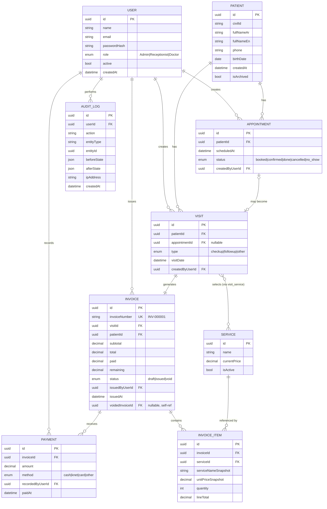

# Clinic Management & Billing System — Pre-Development Architecture Review
**Prepared as:** Senior Software Architect / Tech Lead review, before first line of code
**Sources reviewed:** Technical & Financial Proposal, Technical Architecture Document (أركتكتشير), and the legacy patient data file (`BB.xlsx`)

> A note on `BB.xlsx`: it contains **real patient PII** — phone numbers, full Arabic/English names, and sequential file numbers, ~6,000+ rows, laid out in repeated side-by-side blocks (not a clean single table). This is treated below as sensitive data and is not reproduced. Its structure directly informs the "data migration" risk discussed in Section 1 and the checklist in Section 9.

---

## 1. Requirements Analysis

### 1.1 Functional Requirements (extracted from the proposal)
- Patient registration & unified patient file (data, visits, invoices, payments)
- Patient search by civil ID, name, or phone
- Appointments: create/edit/cancel, statuses (booked, confirmed, done, cancelled, no-show)
- Visits: type (checkup/follow-up/other), service selection
- Service catalog managed by Admin, editable without affecting historical invoices
- Invoice: auto line-item calculation (price × qty → subtotal), auto invoice numbering (`INV-000001`)
- Payments: record amount paid → system computes remaining + status (Unpaid/Partially Paid/Paid)
- Invoice → PDF → print or share via WhatsApp (`wa.me` link)
- Dashboard: today's appointments/visits/invoices/revenue, unpaid invoices, filter by period
- RBAC: Admin / Receptionist / Doctor
- Legacy data migration from Excel (conditional, after review)
- Daily automated backups

### 1.2 Non-Functional Requirements (implied, not explicitly stated — must be made explicit)
- **Performance:** sub-second response for search/dashboard queries even as invoice/visit history grows into the tens of thousands of rows.
- **Availability:** single VPS, single branch — a reasonable target is "business hours uptime," not 99.9% SLA; this should be stated explicitly so expectations match the budget (45 KD).
- **Data integrity:** financial numbers must never be wrong or double-counted — this is the single highest-stakes NFR in the whole system.
- **Usability:** front-desk staff are non-technical; the invoice flow must be nearly error-proof (few clicks, hard-to-misuse UI).
- **Localization:** patient names are Arabic, UI copy in the proposal is Arabic — the app needs **RTL layout + Arabic UI** as a first-class citizen, not an afterthought. This should be decided *before* component styling begins (retrofitting RTL is expensive).
- **Maintainability:** the client will depend on this system indefinitely; code must be maintainable by a different developer after the 2-month support window ends.
- **Auditability:** every financial and access-control action must be traceable to a user and a timestamp.

### 1.3 Missing Requirements (not covered in the proposal — need client answers)
| # | Gap | Why it matters |
|---|---|---|
| 1 | VAT/tax handling — the proposal literally lists it as "needs clarification" | Invoice schema (tax fields) can't be finalized until this is answered — this blocks Section 3 (DB design) and the invoice PDF template. |
| 2 | Payment methods (cash / KNET / card / installments?) | Determines whether `Payment` needs a `method` field and whether partial-payment-over-time needs a payment plan concept. |
| 3 | What exactly can a **Doctor** see/do? | The proposal only says "allowed data/functions only" — is this billing-only, or does the doctor need clinical/diagnosis notes? This is a scope-defining question, not a minor detail (see 1.4). |
| 4 | Invoice correction process | Proposal says invoices are immutable after issuing — but what happens when staff make a genuine mistake (wrong service selected)? Needs a **void + reissue** or **credit note** flow, or staff will end up editing the DB directly, which destroys the "immutable" guarantee. |
| 5 | Uniqueness of patient identity | Is Civil ID mandatory and unique, or is phone number the dedup key? (Legacy data shows some records missing a clear unique identifier.) |
| 6 | Multi-branch / future growth | Confirmed as single branch now — but should be asked explicitly so the DB isn't accidentally hard-coded to assume one location. |
| 7 | Printer/printing environment | "Print or export as PDF" — is there a specific receipt/invoice printer at reception, or just regular A4 printing via browser print dialog? |
| 8 | User provisioning | Who creates staff accounts, resets forgotten passwords, and deactivates a departed employee? |
| 9 | Reporting/export needs | Is there a need to export revenue reports to Excel for the clinic's own accounting? Not mentioned but very likely to come up. |
| 10 | Post-support-window plan | After the 2 free months, what is the maintenance/hosting arrangement? (Hosting fees are already stated as the client's responsibility — but *bug fixing* after month 2 is undefined.) |

### 1.4 Hidden Requirements (not asked for, but implied by the data/domain)
- **Legacy data migration is a real project, not a checkbox.** The sample `BB.xlsx` is not a clean table — it's ~6,000 patient records laid out in repeated side-by-side blocks with inconsistent Arabic/English name pairing and some missing phone numbers. Cleaning, deduplicating, and mapping this into the new schema will take real effort and must be scoped and tested *before* go-live, with a rollback plan if the import goes wrong.
- **This looks like an OB/GYN-type specialty clinic** (services like "Sonar 4D" = obstetric ultrasound). That raises the earlier "what can a Doctor see" question to a higher priority — if any clinical notes end up in the system later, that's a different (and more sensitive) data-protection posture than pure billing data.
- **Snapshot pricing is implicitly required.** The proposal says the service price list can be updated "without affecting old invoices" — this means invoice line items must store their own price at issue time, not a live reference to the service catalog. This has to be designed into the schema from day one (see Section 3).
- **Invoice number generation must be race-safe.** Two receptionists issuing invoices at the same moment must never get the same number — this needs a database-level sequence, not an application-level "get last number + 1" pattern.

### 1.5 Risks
| Risk | Impact | Mitigation |
|---|---|---|
| 20-day timeline vs. full scope (RBAC + invoicing + PDF + deployment + data migration) | High — quality or scope will suffer under time pressure | Freeze scope now (Section 1.3 answers needed immediately); treat invoicing correctness as non-negotiable and trim polish elsewhere (see Roadmap, Section 6) |
| Client indecision on tax/payment methods blocks the invoice module | High — invoice is the core of the whole system | Get written answers to Section 1.3 items #1–2 before Phase 2 of the roadmap starts |
| Legacy data is messy | Medium-High — bad import corrupts patient history | Do the migration as a separate, testable, reversible step — never migrate directly into production without a dry run |
| Single VPS = single point of failure | Medium — an outage takes the clinic fully offline | Off-site backups (already planned) + documented restore procedure; consider a VPS snapshot schedule too |
| "2 months free support" creates ambiguous expectations afterward | Medium — relationship risk, not technical risk | Put a written definition of "support" (bug fixes vs. new features) in the contract |
| Real patient PII in a shared Excel file, in dev machines/chat tools, etc. | Medium — privacy/reputational risk | Treat legacy data as sensitive from day one: don't paste it into non-secure tools, restrict who can open the raw file |

---

## 2. Architecture Review

**Overall: the selected stack is sound and appropriately sized** — it is not over-engineered for a single-branch clinic, and it is not under-engineered for a system that handles money. A few specific things are worth reconsidering, and are flagged only because they matter, not because the stack is wrong.

| Layer | Choice | Verdict | Why |
|---|---|---|---|
| Frontend | React (Vite) + TS + TanStack Query | ✅ Keep | Right-sized; TanStack Query removes the need for a heavy global state library for server data |
| Backend | NestJS + TS | ✅ Keep | Its module/guard/DTO structure is exactly what a role-and-money-sensitive app needs |
| ORM | Prisma | ✅ Keep | Type-safe, good migration tooling, supports Postgres `Decimal` |
| Database | PostgreSQL | ✅ Keep | Correct choice for relational, transactional, financial data |
| Auth | JWT + Role Guards | ✅ Keep, **add refresh tokens** | Access-token-only JWT either lives too long (security risk) or expires too fast (bad UX) — a short-lived access token + rotating refresh token solves both |
| PDF | Puppeteer | ✅ Keep, **isolate it** | Justified because you need pixel-level control to match an existing invoice template — but it runs a full headless Chromium, which is CPU/RAM-heavy. On a small VPS this can spike resource usage under concurrent invoice generation. Recommend: cap concurrency (e.g., a simple queue/semaphore) rather than the API handling PDF requests inline under load. |
| WhatsApp | `wa.me` manual link | ✅ Keep, **but relabel expectations** | This is *not* an automated integration — it's a pre-filled manual share link. Make sure the client understands this explicitly, so "WhatsApp integration" doesn't get misread as automated messaging (that would require the paid WhatsApp Business API — out of scope here). |
| Containers | Docker + Compose | ✅ Keep | Dev/prod parity is exactly the right call for a 20-day timeline with a single deploy target |
| Reverse proxy | Nginx | ✅ Keep | Standard, correct |
| CI/CD | GitHub Actions | ✅ Keep | Build/push automation now, manual deploy trigger for now is pragmatic given the timeline |
| Hosting | Zain Cloud VPS | ✅ Keep | Right-sized for one branch, limited users — no need for clustering/auto-scaling |

### Gaps not covered by the current architecture doc (add these — none are large)
1. **No monitoring/error tracking mentioned.** Add basic structured logging (e.g., Pino) and a lightweight error tracker (e.g., Sentry free tier). Without this, the 2-month "support" period means debugging blind from client screenshots.
2. **No testing strategy mentioned.** Given financial calculations are the highest-risk part of the system, at minimum the invoice-total/remaining/status calculation logic needs automated unit tests. This is cheap insurance relative to the cost of a billing bug.
3. **No mention of rate limiting on auth endpoints.** Add `@nestjs/throttler` on login to prevent brute-force attempts.
4. **PDF/backup storage location** should be a separate Docker volume, not inside the app container's writable layer (container replacement would otherwise wipe generated invoices).

---

## 3. Database Design

### 3.1 Entities
- **User** — staff account (Admin / Receptionist / Doctor)
- **Patient**
- **Appointment**
- **Visit**
- **Service** — the editable price catalog
- **Invoice**
- **InvoiceItem** — line item, **snapshotted**, not a live reference to `Service` price
- **Payment**
- **AuditLog**

### 3.2 Relationships
- `Patient` 1—N `Appointment`
- `Patient` 1—N `Visit`
- `Appointment` 1—0/1 `Visit` (a visit may come from a scheduled appointment or be a walk-in)
- `Visit` 1—1 `Invoice` (one invoice per visit, per the described workflow)
- `Invoice` 1—N `InvoiceItem`
- `InvoiceItem` N—1 `Service` (reference only, for reporting — **not** for pricing)
- `Invoice` 1—N `Payment`
- `User` 1—N `Visit` / `Invoice` / `Payment` (as `createdBy`, for auditability)
- `User` 1—N `AuditLog`

### 3.3 Business Rules (derived directly from the proposal's own wording)
1. **Snapshot pricing:** `InvoiceItem` stores `serviceNameSnapshot` and `unitPriceSnapshot` at the moment the invoice is created — changing a `Service` price later never touches issued invoices. This directly implements the proposal's own requirement that price-list edits shouldn't affect old invoices.
2. **Decimal, not float:** all money fields (`unitPrice`, `subtotal`, `total`, `paid`, `remaining`) use `Decimal` (Postgres `numeric`) to avoid rounding errors — this is explicitly promised in the architecture doc and must be enforced at the schema level, not just in application code.
3. **Immutability after issue:** once `Invoice.status` moves from `draft` to `issued`, its financial fields and line items become read-only at the API layer. Corrections happen via a `voidedInvoiceId` + new invoice, never an in-place edit — this satisfies "immutable" while still allowing real-world mistakes to be fixed traceably.
4. **Unique invoice numbers, DB-enforced:** use a Postgres sequence (or a `SERIAL`/identity column formatted as `INV-000001`), not an application-level "last number + 1" query — this is the only way to guarantee no duplicate/skipped numbers under concurrent requests.
5. **Status is computed, not stored as free text:** `remaining = total - SUM(payments)`; `status` = `unpaid` (paid = 0) / `partially_paid` (0 < paid < total) / `paid` (paid ≥ total). Either compute on read or maintain via a transactional trigger — never let the frontend set status directly.
6. **All money-affecting writes run inside a DB transaction** (issue invoice, record payment) — this is already promised in the architecture doc; the ERD below reflects the tables that participate in those transactions.
7. **Soft-delete, not hard-delete**, for `Patient`, `Appointment`, and `Service` — financial/medical history must never disappear from the database even if a record is "removed" from daily views.

### 3.4 ERD



---

## 4. Backend

### 4.1 Modules
`AuthModule` · `UsersModule` · `PatientsModule` · `AppointmentsModule` · `VisitsModule` · `ServicesModule` · `InvoicesModule` · `PaymentsModule` · `PdfModule` · `DashboardModule` · `AuditLogModule` · `CommonModule` (guards, interceptors, pipes, decorators)

### 4.2 REST API surface (representative, not exhaustive)
```
POST   /auth/login
POST   /auth/refresh
POST   /auth/logout

GET    /patients?search=
POST   /patients
GET    /patients/:id
PATCH  /patients/:id

POST   /appointments
PATCH  /appointments/:id
GET    /appointments?date=

POST   /visits
GET    /visits/:id

GET    /services
POST   /services            (Admin only)
PATCH  /services/:id        (Admin only)

POST   /invoices                (creates a draft)
PATCH  /invoices/:id            (edit draft only)
POST   /invoices/:id/issue      (locks it — assigns number, moves draft → issued)
POST   /invoices/:id/void       (Admin only — creates linked replacement)
GET    /invoices/:id
GET    /invoices/:id/pdf

POST   /invoices/:id/payments
GET    /invoices/:id/payments

GET    /dashboard/summary?from=&to=
GET    /audit-logs?entityType=&entityId=   (Admin only)
```

### 4.3 Authentication & RBAC
- JWT access token (short-lived, ~15 min) + rotating refresh token (httpOnly cookie or secure storage)
- `@Roles('Admin','Receptionist')` decorator + a `RolesGuard` on every protected route — **the guard is the actual security boundary; the frontend hiding a button is UX only**
- Passwords hashed with argon2/bcrypt, never logged, never returned in API responses
- Login endpoint rate-limited (throttler) + account lockout after repeated failures

### 4.4 Invoice Workflow
```
[draft] --(edit line items, freely)--> [draft]
[draft] --(POST /issue)--> [issued]   ← assigns invoice number via DB sequence, snapshots prices, locks fields
[issued] --(mistake found)--> Admin calls /void --> creates a new linked draft, old one flagged void, both kept for audit
[issued] --(payments recorded)--> paid/remaining/status recompute automatically inside a DB transaction
```
This satisfies the proposal's "immutable after issue" promise while giving staff a real, auditable way to fix genuine mistakes — without ever deleting or silently editing financial history.

### 4.5 Audit Logs
Every mutating action on `Patient`, `Invoice`, `Payment`, `Service`, and `User` writes an `AuditLog` row (who, what, before/after, when, from where). This is what turns "immutable invoices" from a policy into something provable later — important given this is financial + health-adjacent data.

### 4.6 Validation
- `class-validator` DTOs on every endpoint, `whitelist: true` to strip unexpected fields
- Business-rule validation lives in the **service layer**, not the controller (e.g., "payment cannot exceed remaining balance," "cannot edit an issued invoice") — DTO validation catches shape errors, service-layer validation catches domain errors
- All list endpoints paginated by default (the patient table alone will have thousands of rows after migration)

### 4.7 PDF Generation
- Puppeteer renders a dedicated HTML/CSS invoice template (built to match the clinic's current physical invoice format)
- PDFs are generated on invoice issue (not on every view) and stored once, referenced by a random, non-sequential file token — **not** by invoice ID or number, so that URLs can't be guessed/enumerated to expose other patients' invoices
- Recommend capping concurrent Puppeteer instances (simple in-process queue) to protect VPS memory under load

### 4.8 WhatsApp Integration
- `wa.me/<phone>?text=<encoded message with a link to the PDF>` — opens WhatsApp with the message pre-filled; staff still taps "send"
- The PDF link must be a signed/expiring or random-token URL (see 4.7) — an unauthenticated but guessable invoice URL would be a real privacy leak

---

## 5. Frontend

### 5.1 Pages
Login · Dashboard · Patients (list/search/detail/create/edit) · Appointments (calendar + list) · Visit creation · Invoice creation/detail · Invoice list · Payments (modal on invoice detail) · Services catalog (Admin) · Users management (Admin) · Settings

### 5.2 Key Components
`PatientSearchBar` · `PatientProfileCard` · `AppointmentCalendar` · `ServiceLineItemTable` (live-recalculating totals as services are added/removed/qty changed) · `InvoiceSummaryPanel` · `PaymentForm` · `RoleProtectedRoute` · reusable `DataTable` + `Pagination` · `ConfirmDialog` · `PdfPreview` / `PrintButton` · `Toast`

### 5.3 Routing
React Router, route-level code-splitting (lazy loading), a `RoleProtectedRoute` wrapper that checks the decoded JWT role claim client-side **only for UX** (hiding nav items) — actual enforcement is always server-side.

### 5.4 Folder Structure (feature-based, matches the monorepo already defined in the architecture doc)
```
apps/web/src/
├── app/                 (router, providers, layout shell)
├── features/
│   ├── auth/
│   ├── patients/
│   ├── appointments/
│   ├── visits/
│   ├── invoices/
│   ├── payments/
│   ├── services/
│   └── dashboard/
├── shared/
│   ├── ui/              (buttons, tables, dialogs — design system)
│   ├── hooks/
│   ├── api/              (TanStack Query hooks per feature)
│   └── lib/               (formatting, RTL/i18n helpers)
└── packages/shared/       (already defined in the monorepo — DTO/type contracts)
```

### 5.5 State Management
- **Server state:** TanStack Query exclusively — caching, background refetch, and cache invalidation on every mutation (e.g., issuing an invoice invalidates the dashboard summary and the invoice list)
- **Client/UI state:** React Context or a very small store (e.g., Zustand) for auth session + locale/direction only — a heavy global store (Redux) is unnecessary at this scope and would slow down the 20-day build

---

## 6. Development Roadmap

**Guiding principle:** build in dependency order, and give the highest-risk piece (invoicing/money) the most buffer and the most testing time, even if that means trimming polish elsewhere.

| Phase | Days | Deliverable | Why this order |
|---|---|---|---|
| 0 | 0–1 | Requirement answers locked (Section 1.3), monorepo + Docker Compose skeleton, shared types package, CI skeleton | Nothing else can proceed correctly without the tax/roles/pricing answers |
| 1 | 2–4 | DB schema + Prisma migrations + seed data, Auth module + RBAC guards | Every other module depends on users existing and being authenticated |
| 2 | 5–8 | Patients module, end-to-end (API + UI) | Patient is the root entity every other feature references |
| 3 | 8–10 | Services catalog + Appointments module | Services must exist before any invoice can be built; appointments can be built in parallel |
| 4 | 10–14 | Visits + Invoice core (create → calculate → issue → immutability) | The highest-risk, highest-value module — gets the largest time block deliberately |
| 5 | 14–16 | Payments + status computation + Dashboard | Depends entirely on Invoice existing first |
| 6 | 16–18 | PDF generation (matched to real invoice template) + WhatsApp share + print | Needs a stable, tested invoice model to render correctly |
| 7 | 18–19 | Audit logs wired across all mutations, RBAC hardening, rate limiting, validation pass | A security/correctness hardening pass, done once features are stable rather than piecemeal |
| 8 | 19–20 | Production Docker images, VPS deploy, Nginx + SSL, backups cron, legacy-data dry-run migration, client UAT | Deployment is last because it depends on a feature-complete, tested system |

**Honest flag:** this is a tight 20-day scope for a system with real financial data, RBAC, PDF generation, and a legacy data migration. If Phase 0 answers are delayed even by 1–2 days, something in Phases 6–8 (polish, full CI/CD automation, or migration testing depth) should be the thing that flexes — never Phase 4 (invoice correctness).

---

## 7. DevOps & Deployment

- **Docker strategy:** multi-stage builds (small final images, e.g., `node:alpine`), non-root container user, separate `docker-compose.yml` (dev) and `docker-compose.prod.yml` (already planned in the architecture doc), `.dockerignore` to keep secrets/node_modules out of build context.
- **VPS deployment:** provision the Zain Cloud VPS, install Docker + Compose, firewall (`ufw`) restricted to ports 22/80/443, SSH key-only login (disable password auth), `fail2ban` for brute-force protection.
- **PostgreSQL hosting:** run as a Docker service backed by a **named volume** (never store DB data in the container's writable layer — a container rebuild would otherwise wipe the database).
- **Backups:** daily `pg_dump` via cron, retained on a rolling policy (e.g., 14 daily + a few monthly), copied **off the VPS** (a second location) so a VPS failure can't take out the backups too — this matches the architecture doc's own stated requirement. Periodically test the *restore* procedure — an untested backup is not a real backup.
- **Environment variables:** `.env` files per environment, never committed to git, `.env.example` documents required keys, GitHub Actions secrets for CI, host-level env or Docker secrets for production.
- **SSL:** Let's Encrypt via certbot in front of Nginx, auto-renew cron, HTTPS-only with HSTS.
- **CI/CD:** GitHub Actions builds and (once tests exist) runs them on every push, builds Docker images and pushes to a registry (e.g., GHCR); deploy stays a manual trigger for now given the timeline, with a path to full auto-deploy later.
- **How the client uses the system after deployment:** staff log in from any browser at the clinic's domain with accounts the Admin creates; day-to-day flow matches the "آلية العمل اليومي" section of the proposal exactly (dashboard → search patient → visit → invoice → payment → PDF/WhatsApp). Future updates are pushed by the developer and require no action from staff. The proposal already states hosting/cloud fees going forward are the client's responsibility — worth restating in writing so it isn't a surprise later.

---

## 8. Security

- **Authentication:** short-lived JWT + rotating refresh tokens, hashed passwords (argon2/bcrypt), rate-limited login, account lockout on repeated failures.
- **Authorization:** enforced server-side on every route via `RolesGuard` — the frontend hiding a menu item is convenience, never the actual boundary.
- **Financial integrity:** `Decimal` money fields, DB transactions around invoice-issue and payment-recording, DB-enforced unique invoice numbers via sequence, immutability after issue with a void+reissue correction path (all as detailed in Sections 3–4).
- **Data protection (this is health-adjacent PII, treat it that way even without a formal local regulation naming it):**
  - TLS everywhere (already planned via Nginx/SSL)
  - App connects to Postgres with a **least-privilege DB role**, not the superuser
  - Backups encrypted at rest, access restricted
  - Application logs must **never** print patient names, phone numbers, or civil IDs in plaintext
  - PDF/invoice download links use random tokens, not sequential/guessable IDs (see 4.7)
- **General hardening:** Helmet middleware, CORS restricted to the known frontend origin only, all input validated via DTOs (Prisma already parameterizes queries, but validation is still required at the boundary), dependency vulnerability scanning in CI (`npm audit` / Dependabot).

---

## 9. Final Review

| Dimension | Score | Why |
|---|---|---|
| **Scalability** | 6 / 10 | Correctly right-sized for one branch and a modest user count — not designed for multi-branch or horizontal scale, which is fine *because that isn't the requirement*, but should be a conscious choice, not an accident. |
| **Security** | 7 / 10 | The financial-integrity design (Decimal, transactions, immutability, RBAC) is genuinely strong. Score isn't higher only because rate limiting, encrypted backups, and log-scrubbing still need to be implemented, not just planned. |
| **Maintainability** | 8 / 10 | Monorepo + shared typed contracts + modular NestJS + feature-based frontend structure is a clean, standard, easy-to-hand-off setup. |
| **Production readiness** | 5 / 10 (as currently documented) | The gap is monitoring/error-tracking, an automated test suite for the invoice math, and the security hardening items above — all addressable within the roadmap in Section 6, none of them require rethinking the architecture. |

---

## Checklist: Things to Fix Before Writing the First Line of Code

- [ ] Get a written answer on **VAT/tax handling** for invoices
- [ ] Get a written answer on **payment methods** to support (cash / KNET / card / other)
- [ ] Clarify exactly what the **Doctor role** can see and do — billing-only, or clinical notes too?
- [ ] Decide the **invoice correction process** (void + reissue, who's authorized) — don't discover this after go-live
- [ ] Confirm the **patient unique identifier**: Civil ID vs. phone (legacy data has gaps in both)
- [ ] Get the **real invoice template** (layout/branding) the client wants the PDF to match
- [ ] Decide the **legacy data migration** approach: dedup rules, required-field policy, and a mandatory dry-run + rollback plan before touching production
- [ ] Confirm **VPS sizing** (RAM/CPU) with Puppeteer's memory footprint in mind, not just baseline app needs
- [ ] Decide the **off-site backup destination** concretely (which second location/service)
- [ ] Add a minimal **error-tracking/logging** decision (even a free-tier tool) before deployment, not after the first production bug
- [ ] Agree in writing on **what "2 months of support" covers** (bug fixes vs. new features) to avoid ambiguity later
- [ ] Do a **first-pass data cleaning review of `BB.xlsx`** with the client before committing to a migration script — the file's structure (repeated blocks, missing phones, mixed Arabic/English pairing) needs a defined mapping strategy up front
