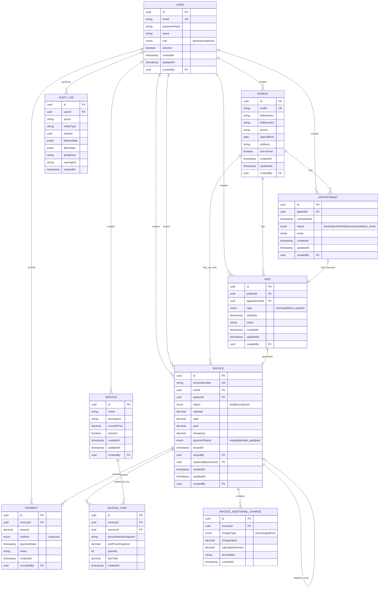

# Database Design & Business Rules

## 1. Entity List

1. **User** - Staff accounts (Admin, Receptionist)
2. **Patient** - Patient records with Civil ID as mandatory unique business identifier
3. **Appointment** - Scheduled appointments with status tracking
4. **Visit** - Clinic visits (checkup, follow-up, other)
5. **Service** - Service catalog with current pricing
6. **Invoice** - Financial invoices with draft/issued/void workflow
7. **InvoiceItem** - Invoice line items with historical price snapshots
8. **InvoiceAdditionalCharge** - Additional charges (percentage or fixed)
9. **Payment** - Payment records (Cash, Visa)
10. **AuditLog** - Audit trail for all critical operations

## 2. Entity Purposes

### User
Stores staff account information for authentication and authorization. Only Admin and Receptionist roles are supported (no Doctor role as this is an administrative system, not a clinical system).

### Patient
Stores patient demographic and contact information. Civil ID is the mandatory unique business identifier used for search and deduplication. The database primary key is an internal UUID. Supports search by Civil ID, name, or phone number.

### Appointment
Manages scheduled patient appointments with status tracking (booked, confirmed, done, cancelled, no-show). Can be associated with a visit or exist independently.

### Visit
Records actual clinic visits (checkup, follow-up, other). Can be linked to an appointment or created as a walk-in. Each visit generates one invoice.

### Service
Maintains the service catalog with current pricing. Managed by Admin only. Historical invoices preserve prices at time of issuance, not current catalog prices.

### Invoice
Financial records for patient visits. Starts as Draft (editable), becomes Issued (immutable financial record). Corrections create replacement invoices while preserving originals for audit.

### InvoiceItem
Line items for invoices. Stores service name and unit price snapshots at time of invoice issuance to preserve historical pricing even if service catalog changes.

### InvoiceAdditionalCharge
Additional charges applied to invoices (tax, fees, etc.). Supports both percentage-based and fixed-amount charges.

### Payment
Records payments against invoices. Supports Cash and Visa methods with extensibility for future methods. Affects invoice paid/remaining amounts and payment status.

### AuditLog
Comprehensive audit trail for all financial and administrative operations. Records who did what, when, and from where.

## 3. Entity Fields

### User

| Field | Type | Constraints | Purpose |
|-------|------|-------------|---------|
| id | UUID | PRIMARY KEY | Unique identifier |
| email | VARCHAR(255) | UNIQUE, NOT NULL | Login email |
| passwordHash | VARCHAR(255) | NOT NULL | Hashed password |
| name | VARCHAR(255) | NOT NULL | Full name |
| role | ENUM | NOT NULL | Admin, Receptionist |
| isActive | BOOLEAN | NOT NULL, DEFAULT true | Account status |
| createdAt | TIMESTAMP | NOT NULL, DEFAULT NOW() | Creation timestamp |
| updatedAt | TIMESTAMP | NOT NULL, DEFAULT NOW() | Last update timestamp |
| createdBy | UUID | FK → User.id | Who created this user |

**WHY:** UUID primary keys prevent enumeration attacks. Email must be unique for login. Role enum restricts to confirmed Admin/Receptionist only. isActive allows account deactivation without deletion. Audit fields track who created accounts.

### Patient

| Field | Type | Constraints | Purpose |
|-------|------|-------------|---------|
| id | UUID | PRIMARY KEY | Unique identifier |
| civilId | VARCHAR(12) | UNIQUE, NOT NULL | Civil ID (Kuwait) |
| fullNameAr | VARCHAR(255) | NOT NULL | Full name in Arabic |
| fullNameEn | VARCHAR(255) | | Full name in English |
| phone | VARCHAR(20) | | Phone number |
| dateOfBirth | DATE | | Date of birth |
| address | TEXT | | Address |
| isArchived | BOOLEAN | NOT NULL, DEFAULT false | Soft-delete flag |
| createdAt | TIMESTAMP | NOT NULL, DEFAULT NOW() | Creation timestamp |
| updatedAt | TIMESTAMP | NOT NULL, DEFAULT NOW() | Last update timestamp |
| createdBy | UUID | FK → User.id | Who created this patient |

**WHY:** Civil ID is UNIQUE and NOT NULL as it's the mandatory business identifier per requirements. The database primary key is an internal UUID for security and distribution. Arabic name is required for Kuwait context. English name optional. isArchived enables soft-delete to preserve historical records. Audit fields for traceability.

### Appointment

| Field | Type | Constraints | Purpose |
|-------|------|-------------|---------|
| id | UUID | PRIMARY KEY | Unique identifier |
| patientId | UUID | FK → Patient.id, NOT NULL | Associated patient |
| scheduledAt | TIMESTAMP | NOT NULL | Scheduled date/time |
| status | ENUM | NOT NULL | booked, confirmed, done, cancelled, no_show |
| notes | TEXT | | Appointment notes |
| createdAt | TIMESTAMP | NOT NULL, DEFAULT NOW() | Creation timestamp |
| updatedAt | TIMESTAMP | NOT NULL, DEFAULT NOW() | Last update timestamp |
| createdBy | UUID | FK → User.id | Who created this appointment |

**WHY:** Status enum matches confirmed requirements. scheduledAt is indexed for calendar queries. notes for optional context. Audit fields for accountability.

### Visit

| Field | Type | Constraints | Purpose |
|-------|------|-------------|---------|
| id | UUID | PRIMARY KEY | Unique identifier |
| patientId | UUID | FK → Patient.id, NOT NULL | Associated patient |
| appointmentId | UUID | FK → Appointment.id | Optional appointment link |
| type | ENUM | NOT NULL | checkup, follow-up, other |
| visitDate | TIMESTAMP | NOT NULL, DEFAULT NOW() | Visit date/time |
| notes | TEXT | | Visit notes |
| createdAt | TIMESTAMP | NOT NULL, DEFAULT NOW() | Creation timestamp |
| updatedAt | TIMESTAMP | NOT NULL, DEFAULT NOW() | Last update timestamp |
| createdBy | UUID | FK → User.id | Who created this visit |

**WHY:** appointmentId is nullable to support both scheduled and walk-in visits. Type enum matches confirmed requirements. visitDate defaults to NOW() for walk-ins. Audit fields for traceability.

### Service

| Field | Type | Constraints | Purpose |
|-------|------|-------------|---------|
| id | UUID | PRIMARY KEY | Unique identifier |
| name | VARCHAR(255) | NOT NULL | Service name |
| description | TEXT | | Service description |
| currentPrice | DECIMAL(10,2) | NOT NULL | Current price |
| isActive | BOOLEAN | NOT NULL, DEFAULT true | Active/inactive flag |
| createdAt | TIMESTAMP | NOT NULL, DEFAULT NOW() | Creation timestamp |
| updatedAt | TIMESTAMP | NOT NULL, DEFAULT NOW() | Last update timestamp |
| createdBy | UUID | FK → User.id | Who created this service |

**WHY:** currentPrice uses DECIMAL(10,2) for precise financial calculations. isActive allows soft-delete of services without affecting historical invoices. Audit fields track price changes.

### Invoice

| Field | Type | Constraints | Purpose |
|-------|------|-------------|---------|
| id | UUID | PRIMARY KEY | Unique identifier |
| invoiceNumber | VARCHAR(20) | UNIQUE, NOT NULL | Unique invoice number |
| visitId | UUID | FK → Visit.id, NOT NULL | Associated visit |
| patientId | UUID | FK → Patient.id, NOT NULL | Associated patient |
| status | ENUM | NOT NULL | draft, issued, void |
| subtotal | DECIMAL(10,2) | NOT NULL, DEFAULT 0 | Sum of line items |
| total | DECIMAL(10,2) | NOT NULL, DEFAULT 0 | Final total including charges |
| paid | DECIMAL(10,2) | NOT NULL, DEFAULT 0 | Total payments received |
| remaining | DECIMAL(10,2) | NOT NULL, DEFAULT 0 | Remaining balance |
| paymentStatus | ENUM | NOT NULL | unpaid, partially_paid, paid |
| issuedAt | TIMESTAMP | | When invoice was issued |
| issuedBy | UUID | FK → User.id | Who issued the invoice |
| replacedByInvoiceId | UUID | FK → Invoice.id | Replacement invoice (if voided) |
| createdAt | TIMESTAMP | NOT NULL, DEFAULT NOW() | Creation timestamp |
| updatedAt | TIMESTAMP | NOT NULL, DEFAULT NOW() | Last update timestamp |
| createdBy | UUID | FK → User.id | Who created this invoice |

**WHY:** invoiceNumber is UNIQUE and enforced at DB level for concurrency safety. Status workflow: draft (editable) → issued (immutable) → void (replaced). All monetary fields use DECIMAL(10,2). paymentStatus computed from paid vs total. replacedByInvoiceId creates audit trail for corrections. All financial fields are NOT NULL with DEFAULT 0 for data integrity.

### InvoiceItem

| Field | Type | Constraints | Purpose |
|-------|------|-------------|---------|
| id | UUID | PRIMARY KEY | Unique identifier |
| invoiceId | UUID | FK → Invoice.id, NOT NULL | Parent invoice |
| serviceId | UUID | FK → Service.id | Reference to service |
| serviceNameSnapshot | VARCHAR(255) | NOT NULL | Service name at issuance |
| unitPriceSnapshot | DECIMAL(10,2) | NOT NULL | Unit price at issuance |
| quantity | INTEGER | NOT NULL, DEFAULT 1 | Quantity |
| lineTotal | DECIMAL(10,2) | NOT NULL | Line item total |
| createdAt | TIMESTAMP | NOT NULL, DEFAULT NOW() | Creation timestamp |

**WHY:** serviceNameSnapshot and unitPriceSnapshot preserve historical pricing per requirements. serviceId is kept for reporting but NOT used for pricing. lineTotal stored for performance but should equal unitPriceSnapshot × quantity. All monetary fields use DECIMAL(10,2).

### InvoiceAdditionalCharge

| Field | Type | Constraints | Purpose |
|-------|------|-------------|---------|
| id | UUID | PRIMARY KEY | Unique identifier |
| invoiceId | UUID | FK → Invoice.id, NOT NULL | Parent invoice |
| chargeType | ENUM | NOT NULL | percentage, fixed |
| chargeValue | DECIMAL(10,2) | NOT NULL | Percentage or fixed amount |
| calculatedAmount | DECIMAL(10,2) | NOT NULL | Calculated amount at issuance |
| description | VARCHAR(255) | | Charge description |
| createdAt | TIMESTAMP | NOT NULL, DEFAULT NOW() | Creation timestamp |

**WHY:** Separate entity allows multiple additional charges per invoice. chargeType enum supports both percentage and fixed as required. chargeValue stores the actual percentage (e.g., 15.00) or fixed amount. calculatedAmount preserves the calculated value at issuance for historical accuracy. description for clarity (e.g., "VAT", "Service Fee").

### Payment

| Field | Type | Constraints | Purpose |
|-------|------|-------------|---------|
| id | UUID | PRIMARY KEY | Unique identifier |
| invoiceId | UUID | FK → Invoice.id, NOT NULL | Associated invoice |
| amount | DECIMAL(10,2) | NOT NULL | Payment amount |
| method | ENUM | NOT NULL | cash, visa |
| paymentDate | TIMESTAMP | NOT NULL, DEFAULT NOW() | When payment was made |
| notes | TEXT | | Payment notes |
| createdAt | TIMESTAMP | NOT NULL, DEFAULT NOW() | Creation timestamp |
| recordedBy | UUID | FK → User.id | Who recorded this payment |

**WHY:** method enum supports confirmed Cash and Visa, extensible for future methods. amount uses DECIMAL(10,2). paymentDate defaults to NOW(). Audit field recordedBy for accountability. All monetary fields precise for financial integrity.

### AuditLog

| Field | Type | Constraints | Purpose |
|-------|------|-------------|---------|
| id | UUID | PRIMARY KEY | Unique identifier |
| userId | UUID | FK → User.id, NOT NULL | Who performed the action |
| action | VARCHAR(100) | NOT NULL | Action performed |
| entityType | VARCHAR(100) | NOT NULL | Entity type affected |
| entityId | UUID | NOT NULL | Entity ID affected |
| beforeState | JSONB | | State before change |
| afterState | JSONB | | State after change |
| ipAddress | VARCHAR(45) | | IP address of request |
| userAgent | TEXT | | User agent string |
| createdAt | TIMESTAMP | NOT NULL, DEFAULT NOW() | When action occurred |

**WHY:** Comprehensive audit trail per security requirements. JSONB for flexible before/after state storage. ipAddress and userAgent for forensic analysis. Indexed on userId, entityType, entityId for audit queries.

## 4. Primary Keys

All entities use UUID primary keys for:
- Security: Prevents enumeration attacks
- Distribution: No coordination needed for multi-instance deployment
- Performance: Sufficient for single-branch clinic scale
- Standardization: Consistent across all entities

## 5. Foreign Keys

| Entity | Foreign Key | References | On Delete |
|--------|-------------|------------|-----------|
| User | createdBy | User.id | SET NULL |
| Patient | createdBy | User.id | SET NULL |
| Appointment | patientId | Patient.id | RESTRICT |
| Appointment | createdBy | User.id | SET NULL |
| Visit | patientId | Patient.id | RESTRICT |
| Visit | appointmentId | Appointment.id | SET NULL |
| Visit | createdBy | User.id | SET NULL |
| Service | createdBy | User.id | SET NULL |
| Invoice | visitId | Visit.id | RESTRICT |
| Invoice | patientId | Patient.id | RESTRICT |
| Invoice | issuedBy | User.id | SET NULL |
| Invoice | replacedByInvoiceId | Invoice.id | SET NULL |
| Invoice | createdBy | User.id | SET NULL |
| InvoiceItem | invoiceId | Invoice.id | CASCADE |
| InvoiceItem | serviceId | Service.id | RESTRICT |
| InvoiceAdditionalCharge | invoiceId | Invoice.id | CASCADE |
| Payment | invoiceId | Invoice.id | RESTRICT |
| Payment | recordedBy | User.id | SET NULL |
| AuditLog | userId | User.id | RESTRICT |

**WHY:** 
- Financial records (Invoice, Payment) use RESTRICT to prevent accidental deletion of referenced data
- Line items (InvoiceItem, InvoiceAdditionalCharge) use CASCADE as they cannot exist without parent invoice
- Audit references (createdBy, issuedBy, recordedBy) use SET NULL to preserve records even if user is deleted
- Appointment link in Visit is SET NULL to allow visit to exist if appointment is deleted

## 6. Relationships and Cardinality

```
User 1—N Patient (createdBy)
User 1—N Appointment (createdBy)
User 1—N Visit (createdBy)
User 1—N Invoice (createdBy, issuedBy)
User 1—N Payment (recordedBy)
User 1—N Service (createdBy)
User 1—N AuditLog (userId)

Patient 1—N Appointment
Patient 1—N Visit
Patient 1—N Invoice (via Visit)

Appointment 0/1—1 Visit (optional, appointment may become visit)
Visit 1—1 Invoice (exactly one invoice per visit)

Invoice 1—N InvoiceItem
Invoice 1—N InvoiceAdditionalCharge
Invoice 1—N Payment
Invoice 0/1—1 Invoice (replacedByInvoiceId - self-reference for void/replacement)

Service 1—N InvoiceItem (referenced only)
```

**WHY:**
- Visit → Invoice is 1:1 because each visit generates exactly one invoice per confirmed workflow
- Appointment → Visit is 0/1:1 because visits can be scheduled (linked to appointment) or walk-ins (no appointment)
- Invoice self-reference via replacedByInvoiceId creates audit trail for corrections
- Service references in InvoiceItem are for reporting only, not pricing (pricing is snapshot)
- No direct Visit ↔ Service relationship: this is an administrative/billing system, not clinical. Services are billed via InvoiceItem, which is the source of truth for billed services.

## 7. Unique Constraints

| Entity | Fields | Purpose |
|--------|--------|---------|
| User | email | Ensure unique login emails |
| Patient | civilId | Ensure unique Civil ID per requirements |
| Invoice | invoiceNumber | Ensure unique, sequential invoice numbers |

**WHY:**
- Civil ID uniqueness prevents duplicate patient records per requirements
- Invoice number uniqueness enforced at DB level for concurrency safety
- Email uniqueness required for authentication

## 8. Important Indexes

| Entity | Fields | Type | Purpose |
|--------|--------|------|---------|
| Patient | civilId | UNIQUE | Fast Civil ID lookup |
| Patient | fullNameAr, fullNameEn, phone | INDEX | Search by name/phone |
| Appointment | patientId, scheduledAt | INDEX | Patient appointment calendar |
| Appointment | scheduledAt | INDEX | Daily appointment queries |
| Appointment | status | INDEX | Status filtering |
| Visit | patientId, visitDate | INDEX | Patient visit history |
| Visit | appointmentId | INDEX | Appointment → Visit lookup |
| Visit | visitDate | INDEX | Daily visit queries |
| Invoice | invoiceNumber | UNIQUE | Invoice number lookup |
| Invoice | patientId | INDEX | Patient invoice history |
| Invoice | status | INDEX | Status filtering (draft/issued/void) |
| Invoice | issuedAt | INDEX | Date range queries |
| Invoice | paymentStatus | INDEX | Unpaid invoice queries |
| InvoiceItem | invoiceId | INDEX | Invoice line item lookup |
| Payment | invoiceId | INDEX | Invoice payment history |
| Payment | paymentDate | INDEX | Date range queries |
| Payment | method | INDEX | Payment method reporting |
| AuditLog | userId | INDEX | User audit trail |
| AuditLog | entityType, entityId | INDEX | Entity audit trail |
| AuditLog | createdAt | INDEX | Date range audit queries |

**WHY:**
- Search indexes support confirmed search requirements (Civil ID, name, phone)
- Date indexes support dashboard filtering by time periods
- Status indexes support workflow queries (drafts, unpaid, etc.)
- Composite indexes optimize common query patterns

## 9. Enums/Statuses

### User.role
- `admin` - Full system access
- `receptionist` - Patient, appointment, visit, invoice, payment management

**WHY:** Only confirmed roles per requirements. No Doctor role as this is administrative system.

### Appointment.status
- `booked` - Initial appointment created
- `confirmed` - Appointment confirmed with patient
- `done` - Appointment completed
- `cancelled` - Appointment cancelled
- `no_show` - Patient did not attend

**WHY:** Matches confirmed requirements in PROJECT_REQUIREMENTS.md.

### Visit.type
- `checkup` - Routine checkup visit
- `follow_up` - Follow-up visit
- `other` - Other visit type

**WHY:** Matches confirmed requirements in PROJECT_REQUIREMENTS.md.

### Invoice.status
- `draft` - Editable, not yet issued
- `issued` - Immutable financial record
- `void` - Replaced by correction invoice

**WHY:** Draft → Issued workflow with immutable issued invoices. Void status for replaced invoices.

### Invoice.paymentStatus
- `unpaid` - No payments recorded (paid = 0)
- `partially_paid` - Some payments recorded (0 < paid < total)
- `paid` - Fully paid (paid ≥ total)

**WHY:** Computed from paid vs total amounts per requirements. Stored for performance but must be maintained via triggers.

### InvoiceAdditionalCharge.chargeType
- `percentage` - Percentage-based charge (e.g., 15% VAT)
- `fixed` - Fixed amount charge (e.g., 5.000 KD service fee)

**WHY:** Supports both percentage and fixed additional charges as confirmed in requirements.

### Payment.method
- `cash` - Cash payment
- `visa` - Visa card payment

**WHY:** Matches confirmed payment methods. Extensible for future methods.

## 10. Financial/Business Rules

### 10.1 Invoice Immutability
**Rule:** Once an invoice status changes from `draft` to `issued`, its financial fields and line items become immutable.

**Implementation:**
- Backend service layer enforces: no updates to issued invoices except status changes
- Application-level validation prevents modifications to issued invoice financial fields
- Corrections: create new invoice with `replacedByInvoiceId` referencing original
- All financial operations use Prisma transactions for atomicity

**WHY:** Per requirements, issued invoices must not be overwritten. Original must be preserved for audit. Backend service layer with Prisma transactions provides better control and testability than database triggers for this NestJS application.

### 10.2 Invoice Number Generation
**Rule:** Invoice numbers must be unique and concurrency-safe.

**Implementation:**
- Use PostgreSQL sequence or identity column
- Format: `INV-YYYYMMDD-NNNNN` or sequential `INV-NNNNNN` (format TBD per open question)
- Assigned at issue time, not draft creation
- Database-enforced uniqueness constraint

**WHY:** Application-level "last number + 1" can fail under concurrent requests. Database sequence guarantees uniqueness.

### 10.3 Payment Status Calculation
**Rule:** Payment status must be automatically calculated from paid vs total amounts.

**Implementation:**
- `paymentStatus` computed as:
  - `unpaid` if `paid = 0`
  - `partially_paid` if `0 < paid < total`
  - `paid` if `paid ≥ total`
- Backend service layer calculates and updates paymentStatus within Prisma transactions
- Never allow frontend to set paymentStatus directly
- PostgreSQL CHECK constraints ensure paid >= 0 and remaining >= 0

**WHY:** Prevents data inconsistency. Single source of truth for payment status. Backend service layer with Prisma transactions provides better testability and maintainability than database triggers for this NestJS application.

### 10.4 Financial Calculations
**Rule:** All monetary values must use precise decimal arithmetic.

**Implementation:**
- All monetary fields use `DECIMAL(10,2)` (PostgreSQL `numeric`)
- No floating-point arithmetic for financial calculations
- Application layer uses decimal/BigDecimal types
- Database-level numeric type prevents rounding errors

**WHY:** Floating-point arithmetic introduces rounding errors unacceptable for financial data.

### 10.5 Invoice Total Calculation
**Rule:** Invoice total must be calculated from line items and additional charges.

**Implementation:**
- `subtotal` = SUM(InvoiceItem.lineTotal)
- `additionalChargesTotal` = SUM(InvoiceAdditionalCharge.calculatedAmount)
- `total` = `subtotal` + `additionalChargesTotal`
- Additional charge calculation (at invoice issuance):
  - Percentage: `subtotal × (chargeValue / 100)`, stored in calculatedAmount
  - Fixed: `chargeValue`, stored in calculatedAmount
- Backend service layer calculates totals within Prisma transactions
- calculatedAmount preserved at issuance for historical accuracy

**WHY:** Single source of truth for invoice totals. Prevents manual manipulation. calculatedAmount snapshot ensures historical financial documents don't depend on recalculating charges later. Backend service layer with Prisma transactions provides better testability than database triggers.

### 10.6 Remaining Balance Calculation
**Rule:** Remaining balance must be calculated from total and paid amounts.

**Implementation:**
- `remaining` = `total - SUM(Payment.amount)`
- Backend service layer calculates and updates remaining within Prisma transactions
- Never allow manual setting of remaining
- PostgreSQL CHECK constraint ensures remaining >= 0

**WHY:** Prevents data inconsistency. Accurate balance tracking critical for billing. Backend service layer with Prisma transactions provides better testability and maintainability than database triggers.

### 10.7 Transaction Safety
**Rule:** All financial operations must be transaction-safe.

**Implementation:**
- All financial operations use Prisma transactions (e.g., `prisma.$transaction`)
- Invoice issuance: transaction covering Invoice, InvoiceItem, InvoiceAdditionalCharge creation with calculated totals
- Payment recording: transaction covering Payment creation and Invoice balance/remaining/paymentStatus update
- Invoice void/replacement: transaction covering status changes and new invoice creation
- PostgreSQL provides ACID guarantees at database level

**WHY:** Prevents partial updates that could corrupt financial data. Prisma transactions provide application-level control while PostgreSQL ensures database-level ACID properties.

## 11. Invoice Revision/Replacement Model

**Workflow:**
1. Draft invoice can be freely edited
2. When issued, invoice becomes immutable
3. If correction needed:
   - Admin creates replacement invoice (starts as draft)
   - Original invoice status changed to `void`
   - Original invoice `replacedByInvoiceId` set to replacement invoice ID
   - Replacement invoice issued with new invoice number
   - Both invoices preserved for audit trail

**Database Schema Support:**
- `Invoice.status` enum: `draft`, `issued`, `void`
- `Invoice.replacedByInvoiceId` self-reference FK
- Original invoice: status = `void`, replacedByInvoiceId = new invoice ID
- Replacement invoice: status = `issued`, no replacedByInvoiceId

**WHY:** 
- Preserves original invoice for audit per requirements
- Creates clear audit trail of corrections
- Allows reporting on original vs corrected amounts
- Prevents direct modification of issued invoices

## 12. Payment Rules

### 12.1 Payment Recording
**Rule:** Payments can be recorded against issued invoices only.

**Implementation:**
- Backend service layer validation: Payment.invoiceId must reference issued invoice
- Application-level check before payment creation

**WHY:** Prevents payments against incomplete/inaccurate invoices. Application-level validation provides better error messages and testability than database triggers.

### 12.2 Payment Amount Validation
**Rule:** Payment amount cannot exceed remaining balance.

**Implementation:**
- Backend service layer validation: `amount ≤ invoice.remaining`
- Application-level check before payment creation
- PostgreSQL CHECK constraint: `Payment.amount > 0`

**WHY:** Prevents overpayment and negative balances. Application-level validation provides better error messages. CHECK constraint ensures data integrity at database level.

### 12.3 Partial Payments
**Rule:** Multiple partial payments allowed until invoice is fully paid.

**Implementation:**
- No restriction on number of payments per invoice
- Each payment reduces remaining balance via backend service layer
- Payment status updates automatically within Prisma transactions

**WHY:** Flexible payment workflow common in clinics. Supports installment-style payments. Backend service layer provides better control than database triggers.

### 12.4 Payment Method Extensibility
**Rule:** System must support adding new payment methods without major architectural changes.

**Implementation:**
- Payment.method as ENUM (not hardcoded in business logic)
- Add new enum values via migration
- No method-specific business logic in core payment flow

**WHY:** Future-proof design per requirements. Currently supports Cash and Visa.

## 13. Service Price Snapshot Rules

**Rule:** Historical invoices must preserve service name and price at time of issuance.

**Implementation:**
- `InvoiceItem.serviceNameSnapshot` stores service name at invoice creation
- `InvoiceItem.unitPriceSnapshot` stores unit price at invoice creation
- `InvoiceItem.serviceId` references Service for reporting only
- Service catalog changes do NOT affect historical InvoiceItem records

**WHY:** 
- Per requirements, service catalog changes must not affect historical invoices
- Allows accurate historical reporting even if services are renamed or repriced
- ServiceId reference enables reporting without breaking historical accuracy

## 14. Soft-Delete/Archive Rules

**Entities with Soft-Delete:**
- **Patient** (`isArchived` flag)
- **Appointment** (no hard delete, status = cancelled)
- **Service** (`isActive` flag)

**Entities with Hard Delete Prohibited:**
- **Invoice** (never delete, use void status)
- **InvoiceItem** (cascade delete only if parent invoice deleted, which should never happen)
- **Payment** (never delete, financial record)
- **AuditLog** (never delete, audit trail)

**Implementation:**
- Soft-delete entities: boolean flag (`isArchived`, `isActive`)
- Queries filter out soft-deleted records by default
- Admin can view soft-deleted records for audit purposes
- Hard delete only via direct database intervention (emergency only)

**WHY:**
- Financial and medical history must never disappear
- Soft-delete allows "removal" from UI while preserving data
- Audit trail requires permanent record of all changes

## 15. Audit Requirements

**Entities Requiring Audit:**
- Patient (create, update, archive)
- Appointment (create, update, cancel)
- Visit (create, update)
- Service (create, update, activate/deactivate)
- Invoice (create, issue, void)
- Payment (create, update)
- User (create, update, deactivate)

**Audit Data Captured:**
- `userId` - Who performed the action
- `action` - What action (CREATE, UPDATE, DELETE, ISSUE, VOID, etc.)
- `entityType` - Type of entity affected
- `entityId` - ID of entity affected
- `beforeState` - JSON representation of state before change
- `afterState` - JSON representation of state after change
- `ipAddress` - IP address of request
- `userAgent` - Client user agent
- `createdAt` - When action occurred

**Implementation:**
- Application layer: Create AuditLog record for every mutating operation
- Use NestJS interceptors or AOP for automatic audit logging
- Sensitive fields (passwords) excluded from beforeState/afterState

**WHY:** Per security requirements, all financial and administrative actions must be traceable to specific users and timestamps.

## 16. Data Integrity Constraints

### 16.1 Check Constraints
- `Invoice.paid >= 0` - No negative payments
- `Invoice.remaining >= 0` - No negative remaining balance
- `InvoiceItem.quantity > 0` - Positive quantities only
- `InvoiceItem.lineTotal >= 0` - No negative line totals
- `Payment.amount > 0` - Positive payment amounts only
- `Service.currentPrice >= 0` - No negative prices
- `InvoiceAdditionalCharge.chargeValue >= 0` - No negative charges
- `InvoiceAdditionalCharge.calculatedAmount >= 0` - No negative calculated charges

### 16.2 Domain Constraints
- No strict date constraints at database level
- Historical records, corrections, imports, and real clinic workflows may legitimately contain dates that violate strict assumptions
- Date validations handled at application layer where appropriate for user experience
- Only genuinely necessary database-level integrity constraints enforced

### 16.3 Referential Integrity
- All foreign keys enforced at database level
- RESTRICT on critical financial relationships
- CASCADE on dependent child records
- SET NULL on audit references to preserve records

**WHY:** Database-level constraints provide last line of defense against data corruption. Application-level validation is first line, database constraints are safety net.

## 17. ERD



## 18. Open Database Questions

### 18.1 Invoice Number Format
**Question:** What is the preferred invoice number format?

**Options:**
- Sequential: `INV-000001`, `INV-000002`, etc.
- Date-based: `INV-20240821-0001`, `INV-20240821-0002`, etc.
- Annual reset: `INV-2024-0001` (resets yearly)

**Why it matters:** Affects database sequence design and user experience. Sequential is simplest but date-based may be preferred for accounting.

**Current decision:** Deferred to client confirmation per PROJECT_REQUIREMENTS.md open questions.

### 18.2 Civil ID Validation
**Question:** Should Civil ID format be validated (Kuwait Civil ID format)?

**Options:**
- Validate Kuwait Civil ID format (12 digits)
- Accept any string format
- Validate length only (12 characters)

**Why it matters:** Affects data quality and user experience. Kuwait Civil IDs have specific format.

**Current decision:** Accept any string for flexibility, consider format validation at application layer if needed.

### 18.3 Overpayment Handling
**Question:** How should overpayments be handled?

**Options:**
- Reject overpayments (payment cannot exceed remaining)
- Allow overpayments and create credit balance
- Allow overpayments with refund workflow

**Why it matters:** Affects payment validation rules and credit balance tracking.

**Current decision:** Reject overpayments per current design (payment ≤ remaining). Credit balance system not in current scope.

### 18.4 Invoice Additional Charge Limits
**Question:** Are there maximum limits on additional charges?

**Options:**
- No limits
- Maximum percentage (e.g., max 25%)
- Maximum fixed amount
- Both percentage and fixed limits

**Why it matters:** Affects data validation and business rules.

**Current decision:** No limits per current design. Limits can be added via application validation if needed.

### 18.6 Patient Phone Uniqueness
**Question:** Should phone numbers be unique per patient?

**Options:**
- Unique (one phone per patient)
- Non-unique (family members may share phone)

**Why it matters:** Affects data quality and search behavior.

**Current decision:** Non-unique. Family members may share phone numbers in Kuwait context.

### 18.7 Invoice Date Range Constraints
**Question:** Should there be constraints on invoice date ranges?

**Options:**
- Invoice must be issued on same day as visit
- Invoice can be issued within X days of visit
- No time constraint

**Why it matters:** Affects business workflow and data validation.

**Current decision:** No time constraint. Flexible billing workflow per clinic operational needs.

### 18.8 Audit Log Retention
**Question:** What is the retention policy for audit logs?

**Options:**
- Keep forever
- Retain for X years
- Archive after X period

**Why it matters:** Affects storage requirements and data governance.

**Current decision:** Keep forever per current design. Retention policy can be implemented via archiving if needed.

---

**Note:** This database design reflects all confirmed requirements from PROJECT_REQUIREMENTS.md. No Doctor role, no clinical features, no Prisma schema code, no migrations. Design prioritizes financial correctness, data integrity, auditability, and simplicity for single-branch clinic operations.
